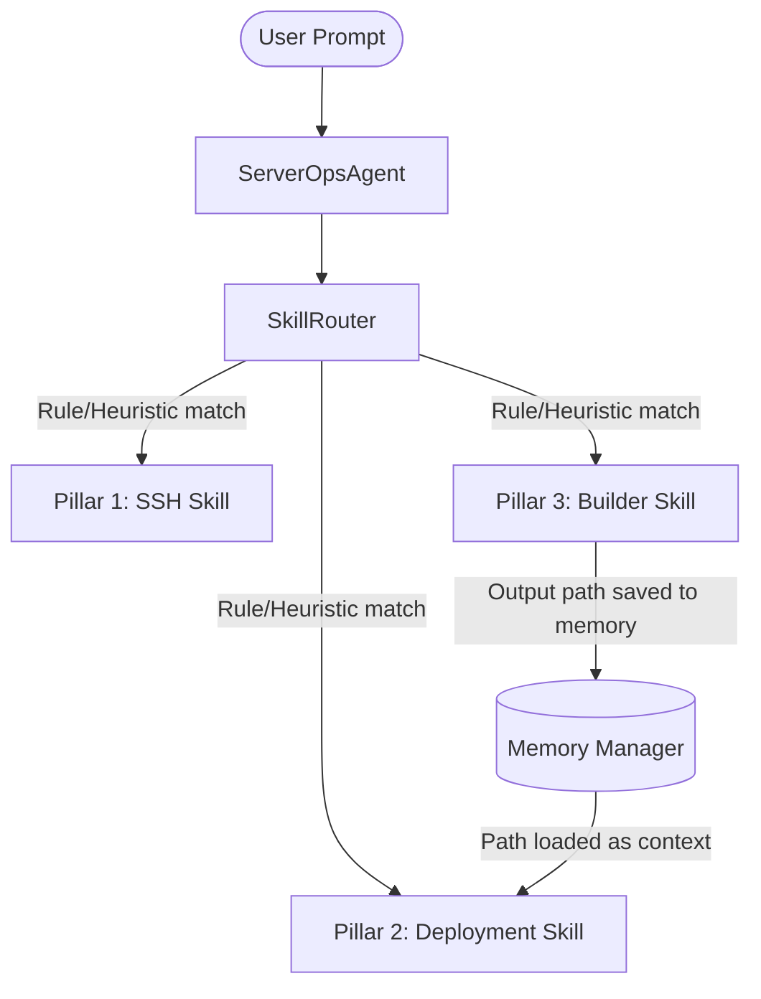
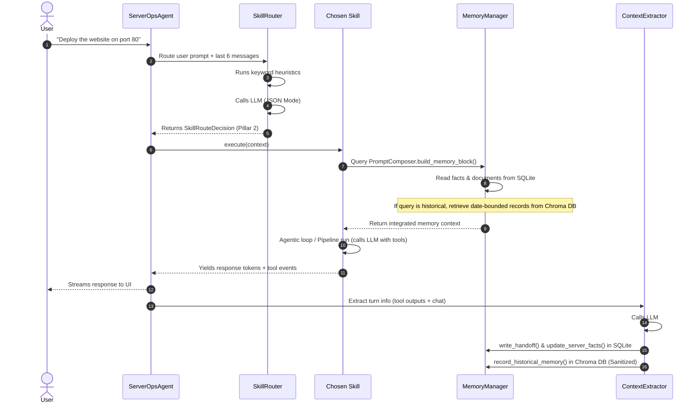

# ShellMate: System Architecture & Design Guide

This guide describes the complete technical architecture of **ShellMate**, designed to help you explain the project's internal mechanics during interviews.

---

## 1. High-Level System Layers

ShellMate is built using a decoupled, four-tier architecture:

```text
+-------------------------------------------------------+
|                      STREAMLIT UI                     |  <- Frontend Control Surface
+--------------------------+----------------------------+
                           | HTTP Requests / NDJSON Streams
                           v
+-------------------------------------------------------+
|                      FASTAPI API                      |  <- API Management & Routing
|   Routes: Chat, Servers, keys, Sessions, Commands     |
+--------------------------+----------------------------+
                           | Instantiates
                           v
+-------------------------------------------------------+
|                    RUNTIME ENGINE                     |  <- Routing, Memory & Execution
|   ServerOpsAgent, SkillRouter, ContextExtractor      |
+--------------------------+----------------------------+
                           | Executes Actions
                           v
+-------------------------------------------------------+
|                    EXECUTION LAYER                    |  <- Real-world interaction
|   SSH (Paramiko), Docker Pipeline, Builder Tools      |
+-------------------------------------------------------+
```

1. **Frontend Layer (Streamlit)**: Serves as the interactive UI. Communicates with the FastAPI backend using standard HTTP APIs and displays streamed tokens using NDJSON (Newline Delimited JSON) protocol.
2. **Control API Layer (FastAPI)**: Serves endpoints for managing servers, uploading keys, keeping track of sessions, and initiating agent turns.
3. **Runtime Engine Layer (Python)**: Drives conversational routing, runs skills, manages state, and runs background context extraction.
4. **Execution Layer**: Real-world operations executing remote commands via SSH (using Paramiko) or managing local/remote Docker configurations.

---

## 2. Core Pillars & Interconnection

ShellMate separates operations into three specialized **Pillars** (Skills). This separation represents a crucial architectural decision: **separating safe diagnostic diagnostics from dangerous infrastructure changes.**



### Pillar 1: Day-to-Day Server Management (`SSHSkill`)
* **Purpose**: Conversational diagnostics (checking disk usage, ports, uptime, inspecting logs).
* **Execution Style**: Interactive ReAct (Reasoning and Acting) loop. The LLM repeatedly decides what read-only server commands to execute via SSH, inspects outcomes, and outputs a concise user-friendly summary.
* **Safety constraint**: Prompted never to execute destructive commands (like modifying packages or stopping services) without explicit user confirmation.

### Pillar 2: Structured Deployment Engine (`DeploymentSkill`)
* **Purpose**: Orchestrates multi-step, safety-critical Docker and Docker Compose rollouts.
* **Execution Style**: A strict, stage-driven pipeline. Rather than giving the LLM raw terminal access to install packages, it uses a deterministic sequence:
  1. *Validation*: Check if Docker is installed.
  2. *Preparation*: Inspect paths, ports, and generate deployment configuration (Dockerfiles, Compose files).
  3. *Approval*: Present proposed files and port mappings to the user and halt until confirmed.
  4. *Rollout*: Run commands on the server to pull, build, and deploy containers.

### Pillar 3: Builder (`BuilderSkill`)
* **Purpose**: Generative static site creator (HTML, CSS, JS) tailored to brand styles.
* **Execution Style**: Interactive design flow. Analyzes prompt specificity. If the prompt is too vague, it conversationally extracts visual preferences (discovery mode) before invoking the LLM to output structured JSON containing the static assets. Files are directly written to the server via the `BuilderTool`.

### How the Pillars Interconnect
The pillars are not isolated; they share state through the **Memory Manager** and **Session State**:
* **Pillar 3 to Pillar 2 Handoff**: When the user requests a website to be built (*Pillar 3*), the generated folder path is persisted in memory. If the user next says *"deploy this app"*, the **Skill Router** shifts to *Pillar 2*, which extracts the path from memory and rolls it out as a Dockerized app without asking the user to specify the path again.

---

## 3. The Turn Lifecycle & LLM Orchestration

Every chat message submitted by the user kicks off a pipeline of LLM interactions:



1. **Routing Turn**: `SkillRouter` combines heuristic keyword matching and an LLM classification prompt to select a skill (Pillar).
2. **Context Assembly & Hydration**: The chosen skill delegates prompt construction to `PromptComposer`. The composer reads active facts and documents from the SQLite database and, if a historical query is detected, fetches semantic date-bounded records from the Chroma vector database.
3. **Execution & Tool Usage**: The skill calls `OllamaModelClient`. If the skill supports tools (like SSH command execution), the LLM outputs tool calls. The runtime executes them, feeds the results back to the LLM history, and loops until completion.
4. **Streaming Response**: Tokens are generated and streamed back to the Streamlit UI immediately for a responsive user experience.
5. **Silent Fact Extraction & Dual Database Write**: Once the turn completes, the `ContextExtractor` runs a silent, background LLM call. It evaluates the turn's context and tool outputs, parses discovered details, writes them to the SQLite store (updating active facts, sessions, and handoffs), and records the sanitized historical summary to the Chroma vector database.

---

## 4. The Memory System

A key feature of ShellMate is its hybrid memory architecture, combining a structured relational database (SQLite) for real-time state tracking and a semantic vector database (Chroma) for historical context retrieval.

```text
               +----------------------------------------+
               |             MemoryManager              |
               +-------------------+--------------------+
                                   |
                  +----------------+----------------+
                  |                                 |
                  v                                 v
   +-----------------------------+   +-----------------------------+
   |     SQLite Memory Store     |   |   Vector Historical Store   |
   |  - memory_documents         |   |  - Chroma DB Backend        |
   |  - memory_facts (Upserted)  |   |  - nomic-embed-text         |
   |  - memory_observations      |   |  - Secret Sanitizer         |
   +-----------------------------+   +-----------------------------+
```

### 4.1. Real-Time State: SQLite Memory Store
To prevent conflicting server information (e.g. a port marked both "free" and "occupied" simultaneously in append-only files), ShellMate stores active facts in SQLite (`backend/data/memory.db`):
* **`memory_documents`**: Stores larger, unstructured texts like the short-term `session` context and inter-skill `handoff` notes.
* **`memory_facts`**: Stores key-value server parameters separated by category (`Paths`, `Packages`, `Ports`, `Containers`). On new observations, facts are matched by a hash key and updated using an `ON CONFLICT DO UPDATE` (UPSERT) clause. This guarantees that facts remain non-contradictory.
* **`memory_observations`**: Logs raw transaction payloads with sequential timestamps.

### 4.2. Historical Context: Semantic Vector Memory
Longer-term, historical summaries generated by the `ContextExtractor` at the end of each turn are recorded in a vector database:
* **Vector Store & Embeddings**: Uses Chroma DB configured with LangChain and Ollama's `nomic-embed-text` model.
* **Security & Sanitization**: Before writing to Chroma, raw summaries pass through an automated sanitizer that redacts SSH private keys and masks sensitive credentials (e.g. `password=[REDACTED]`) to prevent credential leakage in vectors.
* **Metadata Scoping**: Entries are indexed with `server_id`, `session_id`, `source`, `observed_at`, and `observed_date` fields. This ensures vector search queries retrieve documents isolated strictly to the active server.

### 4.3. Date-Aware Heuristics & Context Injection
When the user communicates with a skill, the system prompt is dynamically hydrated:
1. **Keyword Analysis**: The `PromptComposer` checks if the query asks about historical events (using terms like *previously*, *earlier*, *history*, *before*, *ago*, etc.).
2. **Relative Date Resolution**: The composer decodes relative time markers like *"today"*, *"yesterday"*, and *"X days/weeks/months/years ago"* into concrete calendar dates.
3. **Bounded Vector Query**: A similarity search is dispatched to Chroma, scoped to the server ID, and filtered in Python to match the resolved date range.
4. **Context Injection & Hallucination Guard**:
   * If relevant records are found, they are injected under `--- RELEVANT HISTORICAL SERVER CONTEXT ---`.
   * If a historical range query returns empty, the composer inserts a warning to the LLM: preventing the model from hallucinating past operations.

---

## 5. Centralized LLM Client

The model communication is wrapped cleanly inside `OllamaModelClient`:
* Decoupled from the rest of the application.
* Standardizes inputs into format structures compatible with Ollama's local inference schemas.
* Abstracts tool schema registrations (`self._ssh_tool.schema`).

---
