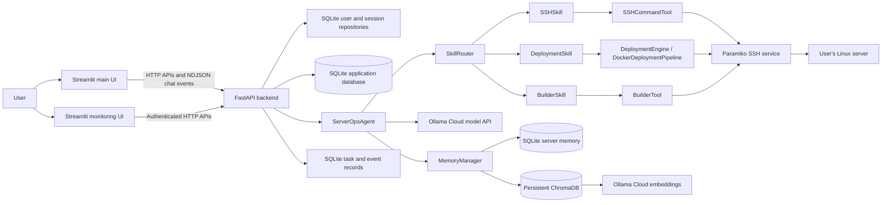
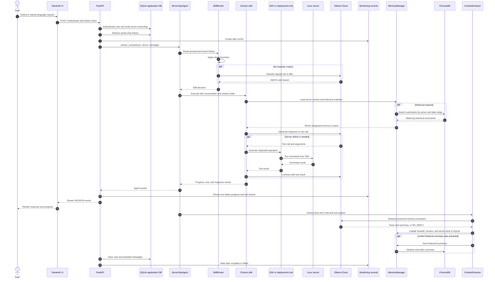

# ShellMate Architecture

This document describes the architecture implemented in the current codebase. ShellMate lets an authenticated user ask for Linux server operations in natural language, then routes the request through a skill that can use SSH tools, prepare an approved Docker deployment, or generate a static website.

## System overview

```mermaid
flowchart LR
    User[User] --> UI[Streamlit main UI]
    User --> MonitorUI[Streamlit monitoring UI]
    UI -->|HTTP APIs and NDJSON chat events| API[FastAPI backend]
    MonitorUI -->|Authenticated HTTP APIs| API
    API --> Auth[SQLite user and session repositories]
    API --> AppDB[(SQLite application database)]
    API --> Agent[ServerOpsAgent]
    Agent --> Router[SkillRouter]
    Router --> SSH[SSHSkill]
    Router --> Deploy[DeploymentSkill]
    Router --> Builder[BuilderSkill]
    SSH --> SSHTool[SSHCommandTool]
    Deploy --> DeployEngine[DeploymentEngine / DockerDeploymentPipeline]
    Builder --> BuilderTool[BuilderTool]
    SSHTool --> SSHService[Paramiko SSH service]
    DeployEngine --> SSHService
    BuilderTool --> SSHService
    SSHService --> Server[User's Linux server]
    Agent --> Model[Ollama Cloud model API]
    Agent --> Memory[MemoryManager]
    Memory --> MemoryDB[(SQLite server memory)]
    Memory --> VectorDB[(Persistent ChromaDB)]
    VectorDB --> Embed[Ollama Cloud embeddings]
    API --> Monitor[SQLite task and event records]
```

The main UI handles sign-in, server registration, chat, and deployment interaction. The separate monitoring UI displays saved agent tasks, progress, tool activity, and deployment status. Both communicate with the FastAPI backend; neither connects directly to servers or databases.

## The Turn Lifecycle

```mermaid
sequenceDiagram
    autonumber
    actor User
    participant UI as Streamlit UI
    participant API as FastAPI
    participant DB as SQLite application DB
    participant Agent as ServerOpsAgent
    participant Router as SkillRouter
    participant Skill as Chosen skill
    participant Tool as SSH or deployment tool
    participant Server as Linux server
    participant Model as Ollama Cloud
    participant Monitor as Monitoring records
    participant Memory as MemoryManager
    participant Chroma as ChromaDB
    participant Extractor as ContextExtractor

    User->>UI: Submit a natural language request
    UI->>API: POST /chat/stream with bearer token
    API->>DB: Authenticate user and verify server ownership
    API->>DB: Restore saved chat history
    API->>Monitor: Create task record
    API->>Agent: stream_turn(session, server, message)
    Agent->>Router: Route prompt and recent history
    Router->>Router: Apply intent heuristics
    opt No heuristic match
        Router->>Model: Classify request into a skill
        Model-->>Router: Skill ID and reason
    end
    Router-->>Agent: Skill decision
    Agent->>Skill: Execute with conversation and session state
    Skill->>Memory: Load server context and historical matches
    opt Historical request
        Memory->>Chroma: Search summaries by server and date range
        Chroma-->>Memory: Matching historical summaries
    end
    Memory-->>Skill: Return integrated memory context
    Skill->>Model: Generate response or tool call
    opt Server action is needed
        Model-->>Skill: Tool call and arguments
        Skill->>Tool: Execute requested operation
        Tool->>Server: Run command over SSH
        Server-->>Tool: Command result
        Tool-->>Skill: Tool result
        Skill->>Model: Continue with tool result
    end
    Skill-->>Agent: Progress, tool, and response events
    Agent-->>API: Agent events
    API->>Monitor: Persist non-token progress and tool events
    API-->>UI: Stream NDJSON events
    UI-->>User: Render response and progress
    Agent->>Extractor: Extract facts from chat and tool outputs
    Extractor->>Model: Request structured memory extraction
    Model-->>Extractor: Facts and summary, or NO_REPLY
    Extractor->>Memory: Update handoff, session, and server facts in SQLite
    opt Useful historical summary was extracted
        Extractor->>Memory: Save historical summary
        Memory->>Chroma: Sanitize and index summary
    end
    API->>DB: Save user and assistant messages
    API->>Monitor: Mark task complete or failed
```

## Request and agent flow

1. The UI sends a request with the user's bearer session token. The API resolves the user and checks ownership of the selected server for protected server and chat operations.
2. The API restores saved chat messages into the agent's process-local session store and creates a monitoring task.
3. `ServerOpsAgent` asks `SkillRouter` to select a skill. Deployment and website-generation intent have heuristic routing; other requests use an Ollama model classification call, with a default SSH skill fallback if the response cannot be parsed.
4. The selected skill builds its prompt with `PromptComposer`, including relevant server memory when applicable, and calls `OllamaModelClient`.
5. When needed, the skill invokes an explicit tool. SSH operations use Paramiko through `SSHService`; tool results are fed back to the skill so it can report observed results.
6. The API writes non-token progress and tool events to the monitoring tables and sends chat events to the UI as newline-delimited JSON (`application/x-ndjson`).
7. At the end of the turn, `ContextExtractor` makes a separate Ollama call to identify useful facts. It updates SQLite memory and may add a sanitized summary to ChromaDB. Memory extraction and vector search/indexing failures are designed not to fail the user-facing turn.

## Skills and execution boundaries

### SSH operations

`SSHSkill` handles server diagnostics and requested server-side actions. It calls the `run_ssh_command` tool in a bounded tool loop. Its instructions require server-side evidence before claiming an operation succeeded, including a follow-up verification command after changes. Destructive operations and package installation require explicit user approval.

### Docker deployment

`DeploymentSkill` delegates to `DeploymentEngine` and `DockerDeploymentPipeline`. The pipeline gathers deployment details, validates the request, generates deployment files and a plan, saves the pending approval state, and waits for explicit approval. After approval, it writes the files to the remote server, runs the Docker deployment actions through SSH, then performs post-deployment verification. The workflow state is held in the current agent process's session state.

### Static website generation

`BuilderSkill` generates HTML, CSS, and JavaScript files, then asks `BuilderTool` to write them to the selected server through SSH. The generated project path is retained in the agent session state for a later deployment handoff.

## Persistence and memory

The current application uses SQLite; it does not use PostgreSQL in this code version.

| Store | Purpose | Current location/configuration |
|---|---|---|
| Application SQLite database | Users, hashed passwords, hashed bearer-session tokens, registered servers, chat history, and monitoring tasks/events | `backend/data/servers.db` |
| Memory SQLite database | Per-server handoff/session documents, upserted facts, and observations | `backend/data/memory.db` |
| ChromaDB | Semantic retrieval of historical server summaries | Persistent directory configured as `backend/data/chroma` |
| Agent session store | Active conversation messages and pending skill/deployment state | In process memory; chat history is restored from SQLite on requests |

Passwords use scrypt hashes. Raw session tokens are returned to the client while only their hashes are stored. SQLite repositories scope server, chat, and monitoring queries by user where applicable. SSH private keys are validated and stored locally under an opaque generated filename; file permissions are restricted on Linux. The current implementation does not retrieve SSH keys from Azure Key Vault.

### Historical retrieval

The context extractor attempts to save one sanitized summary to Chroma after a completed turn when it identifies useful information. Chroma metadata includes the server and session identifiers, source, and observation time. Historical prompts trigger a server-scoped similarity search; supported relative dates are resolved and matching records are filtered by date before they are added to the prompt. Ollama Cloud's `nomic-embed-text` model generates embeddings when records are added and when retrieval queries are made. Existing records are not re-embedded on every turn.

## Backend API and monitoring

FastAPI exposes authentication, health, chat/history, server and key management, command/session, and monitoring routes under `/api/v1`. Protected routes use bearer-token authentication. Chat streaming is newline-delimited JSON over HTTP rather than WebSockets. The monitoring endpoints return user-scoped task summaries and event details, including skill, step, tool, command, result, and timestamps; response token chunks are excluded from persisted monitoring events.

The backend logs to the console and a rotating `logs/app.log` file when file logging is enabled. Request IDs, HTTP method/path/status, duration, and application operation events support local debugging. In Docker Compose, `./logs` is mounted into the backend container.

## Model integration

`OllamaModelClient` wraps the Ollama Python client and reads the configured model, API base URL, and API key from runtime settings. The same client serves routing, skill responses, context extraction, and deployment preparation. The vector store separately uses `langchain-ollama` embeddings against the configured Ollama Cloud endpoint.

## Container deployment

The repository defines three application images: FastAPI backend (`backend/app/Dockerfile`), main Streamlit UI (`frontend/Dockerfile`), and monitoring UI (`monitoring_agent/Dockerfile`). Docker Compose connects them on a private network; the frontend and monitoring service use `http://backend_app:8000/api/v1` inside that network. When running as separate Azure Container Apps, configure each UI's `API_BASE_URL` with the backend app URL and set the backend's `CORS_ALLOWED_ORIGINS` to the browser-facing UI origins.

Containerizing the applications does not by itself make their state shared across replicas. The current source uses local SQLite files, local SSH key files, a persistent Chroma directory, and in-process workflow state. Preserve the data directories with persistent storage, and keep the backend at one replica unless state has been moved to shared services and workflow state is no longer process-local.

## Evaluation

`evals/test_cases.json` contains structured routing and deployment-safety cases. `evals/run_evaluation.py` runs the checks and can write a local Evidently HTML report and workspace data. Evaluation is a developer-invoked task, not part of normal chat request processing.
